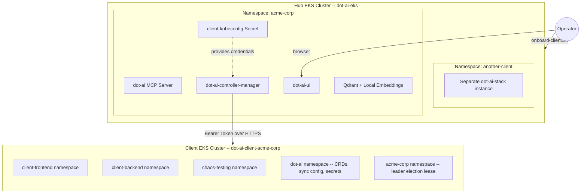

# Dot-AI: Hub-and-Spoke Multi-Cluster DevOps Agent

Dot-AI is an AI-powered Kubernetes operations agent. This repository provides a fully automated deployment of Dot-AI in a multi-cluster **Hub-and-Spoke** topology. 

By default, Dot-AI monitors the cluster it is installed on; this project decouples the AI agent (the **Hub**) from the infrastructure it manages (the **Clients/Spoke clusters**), enabling a single Hub to manage multiple remote clusters from a central dashboard.

---

## How the Setup Works

The architecture is built on the concept of a **Remote Brain (Hub)** and **Managed Infrastructure (Clients)**.

1.  **The Hub Cluster:** You provision a central EKS cluster (`hub-eks-cluster/`). This cluster runs the AI models, the Web UI, and the management controller. It exposes a public endpoint via an AWS Network Load Balancer (NLB).
2.  **The client Clusters:** You provision one or more Spoke clusters (`aws-client-setup/`). These do not run the AI stack; they only host your workloads.
3.  **The Onboarding Process:** You run the `onboard-client.sh` script. This script:
    - Extracts a secure, cloud-agnostic kubeconfig from the Client cluster.
    - Injects that kubeconfig into the Hub cluster.
    - Deploys a "shadow" instance of the Dot-AI stack on the Hub that is permanently wired to the remote Client cluster.
    - Bootstraps the Client cluster with the necessary CRDs and sync rules so it can report back to the Hub.

The result is a single pane of glass where you can manage multiple clusters through a unified, AI-enhanced interface.

---

## Architecture Overview



Each client gets its own isolated namespace on the Hub with a dedicated Helm release, ingress subdomain, and authentication token. The Hub Controller reads the injected kubeconfig Secret and connects to the remote Client cluster to discover and sync resources.

---

## Repository Structure

```
.
├── hub-eks-cluster/          # Terraform: provisions the Hub EKS cluster + NGINX Ingress
├── aws-client-setup/         # Terraform: provisions a Client EKS cluster
├── local_testing/            # Scripts for running the full setup in Kind (Docker)
├── dot-ai-stack/             # Helm umbrella chart (dot-ai + controller + UI + qdrant)
├── onboard-client.sh         # Production onboarding script (EKS / GKE / ACP / file)
├── client.vars.example       # Template for client configuration
└── docs/                     # Detailed architectural and script documentation
```

---

## Quick Start Guides

Choose your deployment mode:

### 1. Remote / Production (AWS EKS)
- **Step 1:** Provision the [Hub Cluster](hub-eks-cluster/README.md).
- **Step 2:** Provision a [Client Cluster](aws-client-setup/README.md).
- **Step 3:** [Onboard the Client](onboard-client.sh) using a vars file.

### 2. Local Development (Kind)
- See the [Local Testing Guide](local_testing/README.md) to spin up two virtual clusters in Docker for rapid iteration without cloud costs.

---

## Prerequisites

- [Terraform](https://developer.hashicorp.com/terraform/downloads) >= 1.6.0
- [AWS CLI](https://aws.amazon.com/cli/) configured (`aws configure`)
- `kubectl`, `helm`, `openssl`
- An OpenAI or Anthropic API Key

---

## Additional Documentation

- [Onboard Client Script Breakdown](docs/onboard-client-script-breakdown.md) -- Detailed look at the production onboarding logic.
- [Local Testing Script Breakdown](docs/local-testing-script-breakdown.md) -- How we handle Kind-specific networking and automation.
- [Helm Chart Modifications](docs/helm-chart-changes.md) -- How kubeconfig injection was wired into the core chart.

---

## Known Pitfalls & Solutions

### NLB IP Changes
When you recreate the Hub cluster, AWS assigns a new NLB IP. You must update `BASE_DOMAIN` in your vars file and re-run the onboarding script.

### Cross-Cluster Security Groups
The Hub cluster needs to reach the Client cluster on port 443. The `aws-client-setup/` module handles this for you by allowing the VPC CIDR. If provisioning manually, you must add this ingress rule.

---

## Teardown

```bash
# 1. Remove Client from Hub
helm uninstall dot-ai-<CLIENT_ID> -n <CLIENT_ID> --kube-context <HUB_CONTEXT>
kubectl delete namespace <CLIENT_ID> --context <HUB_CONTEXT>

# 2. Destroy Clusters
cd aws-client-setup/ && terraform destroy
cd ../hub-eks-cluster/ && terraform destroy
```
 of the cross-cluster synchronization mechanism.