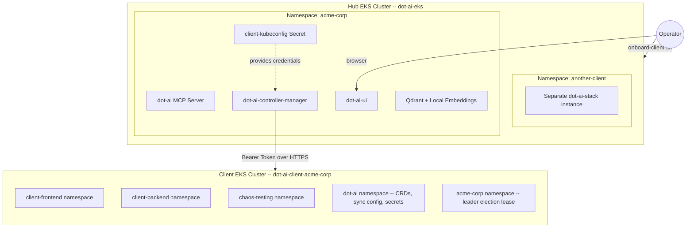

# Dot-AI: Hub-and-Spoke Multi-Cluster DevOps Agent

This repository provides a fully automated deployment of the Dot-AI DevOps agent in a multi-cluster **Hub-and-Spoke** topology. Dot-AI is an AI-powered Kubernetes operations agent. By default, it monitors the cluster it is installed on; this project decouples the AI agent (the Hub) from the infrastructure it manages (the Client/Spoke clusters), enabling a single Hub to manage multiple remote clusters.

The project supports two deployment modes:

- **Local Development** -- uses Kind (Kubernetes IN Docker) clusters for rapid iteration on a single machine.
- **Remote / Production** -- uses real EKS clusters on AWS, connected via the `onboard-client.sh` script.

---

## Architecture Overview



Each client gets its own isolated namespace on the Hub with a dedicated Helm release, ingress subdomain, and authentication token. The Hub Controller reads the injected kubeconfig Secret and connects to the remote Client cluster to discover and sync resources.

---

## Repository Structure

```
.
├── eks-cluster/              # Terraform: provisions the Hub EKS cluster + NGINX Ingress
├── aws-client-setup/         # Terraform: provisions a Client EKS cluster
├── dot-ai-stack/             # Helm umbrella chart (dot-ai + controller + UI + qdrant)
├── onboard-client.sh         # Production onboarding script (EKS / GKE / ACP / file)
├── client.vars.example       # Template for client configuration
├── install-dot-ai-remote.sh  # Local testing script (Kind clusters)
├── setup-client.sh           # Local testing: creates a Kind client cluster
└── docs/                     # Additional documentation
```

---

## Prerequisites

### For Remote / Production Deployment (EKS)

- [Terraform](https://developer.hashicorp.com/terraform/downloads) >= 1.6.0
- [AWS CLI](https://aws.amazon.com/cli/) configured with credentials (`aws configure`)
- `kubectl`
- `helm`
- `openssl`
- An OpenAI or Anthropic API Key

### For Local Development (Kind)

- Docker
- [Kind](https://kind.sigs.k8s.io/) (Kubernetes IN Docker)
- `kubectl`
- `helm`
- `openssl`
- An OpenAI or Anthropic API Key

---

## Remote Deployment Guide (EKS)

### Step 1: Provision the Hub EKS Cluster

```bash
cd eks-cluster/
terraform init
terraform apply --auto-approve
```

This creates the Hub EKS cluster (`dot-ai-eks`) with an NGINX Ingress Controller and a public Network Load Balancer. See [eks-cluster/README.md](eks-cluster/README.md) for full details.

After provisioning, configure kubectl and retrieve the NLB IP:

```bash
aws eks update-kubeconfig --region us-east-1 --name dot-ai-eks
NLB_HOST=$(kubectl get svc ingress-nginx-controller -n ingress-nginx -o jsonpath='{.status.loadBalancer.ingress[0].hostname}')
NLB_IP=$(dig +short "$NLB_HOST" | head -1)
echo "NLB IP: $NLB_IP"
```

### Step 2: Provision the Client EKS Cluster

```bash
cd aws-client-setup/
cp terraform.tfvars.example terraform.tfvars
# Edit terraform.tfvars -- set client_name (e.g. "acme-corp")
terraform init
terraform apply --auto-approve
```

Optionally deploy demo workloads:

```bash
./setup-client-workloads.sh
```

See [aws-client-setup/README.md](aws-client-setup/README.md) for full details.

### Step 3: Onboard the Client to the Hub

```bash
cd ..   # Return to the repository root

# Create a vars file for this client
cp client.vars.example acme-corp.vars
```

Edit `acme-corp.vars` and fill in all required fields:

| Field | Where to Get It |
|---|---|
| `CLIENT_ID` | Choose a unique slug (e.g. `acme-corp`) |
| `HUB_CONTEXT` | Run `kubectl config get-contexts`, copy the Hub cluster ARN |
| `CLOUD_PROVIDER` | `eks` |
| `AWS_REGION` | Same region as the client cluster |
| `EKS_CLUSTER_NAME` | From `terraform output` in `aws-client-setup/` |
| `BASE_DOMAIN` | `<NLB_IP>.nip.io` (the IP from Step 1) |
| `AI_PROVIDER` | `openai` or `anthropic` |
| `AI_API_KEY` | Your API key |

Then run:

```bash
./onboard-client.sh acme-corp.vars
```

### Step 4: Access the Dashboard

The script prints URLs at the end. Open the Web UI in a browser:

```
Web UI:  http://dot-ai-ui-<CLIENT_ID>.<NLB_IP>.nip.io/dashboard
MCP API: http://dot-ai-<CLIENT_ID>.<NLB_IP>.nip.io
```

Log in with the Auth Token printed at the end of the onboarding script output.

---

## What the Onboarding Script Does

The `onboard-client.sh` script performs the following steps:

1. **Validates** the vars file and checks prerequisites.
2. **Fetches** the client cluster kubeconfig using the appropriate cloud CLI.
3. **Creates a ServiceAccount** (`dot-ai-remote-admin`) on the client cluster with `cluster-admin` permissions and generates a native Kubernetes Bearer Token. This avoids injecting cloud CLI exec-based kubeconfigs, which would fail inside the controller pod.
4. **Builds a clean kubeconfig** containing only the client API server URL, CA certificate, and the Bearer Token.
5. **Creates a dedicated namespace** on the Hub for this client and injects the kubeconfig as a Kubernetes Secret.
6. **Deploys a scoped Helm release** of the `dot-ai-stack` into the client namespace on the Hub.
7. **Bootstraps the client cluster**: creates the required namespaces (including the Hub namespace for leader election), migrates CRDs, applies the `ResourceSyncConfig`, and mirrors authentication secrets.
8. **Restarts** the Hub controller to trigger a clean sync cycle.

---

## Local Development Guide (Kind)

For rapid local testing without AWS costs:

```bash
# Step 1: Create the client Kind cluster with demo workloads
./setup-client.sh

# Step 2: Deploy the Hub Kind cluster with cross-cluster wiring
./install-dot-ai-remote.sh
```

Access the dashboard at `http://dot-ai-ui.127.0.0.1.nip.io/dashboard`.

---

## Known Pitfalls

### NLB IP Changes After Cluster Recreation

When you destroy and recreate the Hub EKS cluster via Terraform, AWS assigns a new Network Load Balancer with a new IP. You must update `BASE_DOMAIN` in your vars file with the new IP before re-running the onboarding script. Retrieve the new IP with:

```bash
NLB_HOST=$(kubectl get svc ingress-nginx-controller -n ingress-nginx -o jsonpath='{.status.loadBalancer.ingress[0].hostname}')
dig +short "$NLB_HOST"
```

### TokenRequest Duration Limit

EKS limits the maximum token duration to 24 hours (86400 seconds). The script requests a 10-year token but EKS silently shortens it. For production environments, implement a token rotation mechanism or use IRSA-based authentication.

### Cross-Cluster Security Groups

If the Hub and Client EKS clusters share the same VPC, the Client's control plane Security Group must allow inbound HTTPS (port 443) from the VPC CIDR block. The `aws-client-setup/` Terraform module includes this rule by default. If you provision client clusters manually, you must add this ingress rule yourself.

---

## Teardown

```bash
# 1. Remove the Helm release from the Hub
helm uninstall dot-ai-acme-corp -n acme-corp --kube-context <HUB_CONTEXT>
kubectl delete namespace acme-corp --context <HUB_CONTEXT>

# 2. Destroy the Client cluster
cd aws-client-setup/
terraform destroy

# 3. Destroy the Hub cluster
cd ../eks-cluster/
terraform destroy
```

---

## Additional Documentation

- [Helm Chart Modifications](docs/helm-chart-changes.md) -- How Kubeconfig injection was wired into the chart.
- [Architecture and Script Breakdown](docs/script-breakdown.md) -- Line-by-line history of the cross-cluster synchronization mechanism.