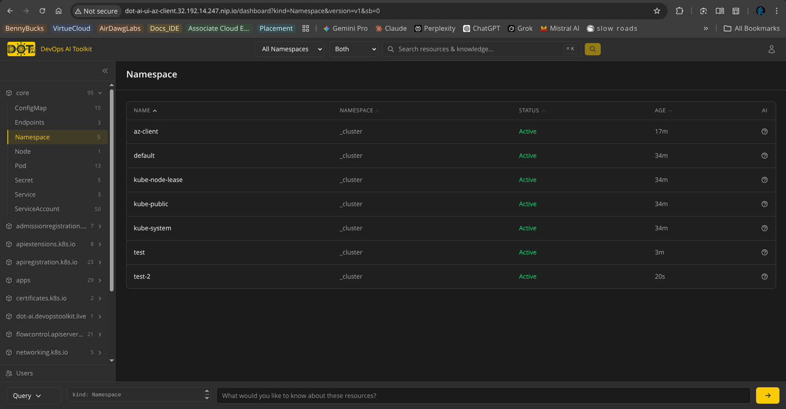

# DOT-AI AKS Client

This document outlines the end-to-end workflow for onboarding a new client using Azure Kubernetes Service (AKS) to the Hub. The process uses a temporary Azure Service Principal to bootstrap permanent, native Kubernetes RBAC tokens.

---

## Phase 1: Client Responsibilities (Granting Access)

The client must perform these steps in their Azure environment to grant initial bootstrapping access.

### 1. Create a Service Principal

The client creates an Azure Active Directory (Azure AD / Entra ID) App Registration and its associated Service Principal. This acts as a dedicated machine identity for the onboarding process.

### 2. Grant Azure Roles

The client assigns this Service Principal specific roles scoped to their AKS cluster (or the Resource Group where the cluster resides):

- **Azure Kubernetes Service Cluster User Role:** This is required so the Azure CLI (`az`) has permission to download the cluster's `kubeconfig` file.
- **Azure Kubernetes Service RBAC Cluster Admin:** If the cluster uses Azure RBAC for Kubernetes Authorization (the enterprise standard), this role grants the Service Principal the `cluster-admin` (`system:masters`) equivalent rights inside the cluster.

> **Why this is required:** The onboarding script needs to create a ServiceAccount and ClusterRoleBinding. Only a cluster administrator can create these cluster-wide RBAC resources, making this high level of privilege mandatory for the initial bootstrap.
> 

### 3. Generate and Share Credentials

The client generates a **Client Secret** (password) for the Service Principal. Securely share the following details with the integration operator:

- Tenant ID
- Client ID (App ID)
- Client Secret
- Subscription ID
- Resource Group Name
- AKS Cluster Name

---

## Phase 2: Operator Responsibilities (Bootstrapping)

These steps are performed internally by the operator to establish the connection from the Hub.

### 1. Authenticate Locally

Authenticate your local terminal session using the Azure CLI to log in as the specific Service Principal provided by the client.

```bash
az login --service-principal -u <Client-ID> -p <Client-Secret> --tenant <Tenant-ID>
```

### 2. Configure the Client Variables

Update the specific `client.vars` file with the client's AKS details.

```bash
# client.vars
CLOUD_PROVIDER="aks"
AKS_SUBSCRIPTION_ID="<client-subscription-id>"
AKS_RESOURCE_GROUP="<client-resource-group>"
AKS_CLUSTER_NAME="<client-aks-cluster>"
```

### 3. Execute the Onboarding Script

Run the onboarding script using the configured variables file.

```bash
./onboard-client.sh client.vars
```

**What this script does:**

1. Runs `az aks get-credentials --resource-group $AKS_RESOURCE_GROUP --name $AKS_CLUSTER_NAME --subscription $AKS_SUBSCRIPTION_ID`, which leverages your active Service Principal session to pull the `kubeconfig` into a temporary file.
2. Uses the native `cluster-admin` rights granted by the Azure RBAC mapping to create the `dot-ai-agent` and `dot-ai-controller-admin` K8s ServiceAccounts on the client cluster.
3. Generates permanent, long-lived Kubernetes tokens for those new ServiceAccounts.
4. Invisibly passes those tokens back to the Hub via standard Helm/Kubernetes secrets and outputs the UI URL and Auth Token.



---

## Phase 3: Cleanup & Security Hand-off

Once the onboarding script successfully outputs the connection details, the bootstrapping phase is complete.

- **Action Required:** Notify the client that they can safely **delete the App Registration / Service Principal** or revoke the Client Secret.
- **Reasoning:** The permanent connection is now established securely via native Kubernetes tokens. This enforces least privilege and completely removes the reliance on cloud-provider identity credentials for ongoing operations.