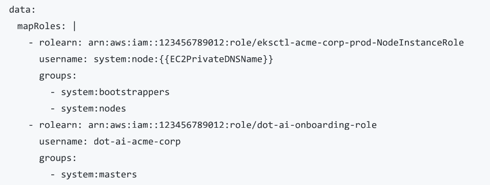

# DOT-AI EKS Client

This document outlines the end-to-end workflow for onboarding a new client using Amazon Elastic Kubernetes Service (EKS) to the Hub. The process uses a temporary AWS IAM Role assumption to bootstrap permanent, native Kubernetes RBAC tokens.

---

## Phase 1: Client Responsibilities (Granting Access)

The client must perform these steps in their AWS environment to grant initial bootstrapping access.

### 1. Create an IAM Role & Policy

- The client logs into their AWS Console and navigates to **IAM -> Roles -> Create role**.
- On the "Select trusted entity" screen, the client MUST select **"AWS account"** to allow an external AWS account to assume the role. They must not select "AWS service" (which is meant for internal service-to-service trust) or "This account".
- They must select **"Another AWS account"** and enter the operator's 12-digit AWS Account ID. *(The operator can provide this by running `aws sts get-caller-identity --query Account --output text`)*.
- On the permissions screen, click "Create inline policy" and paste the required JSON allowing the `eks:DescribeCluster` action. The resource must be specifically scoped to their cluster: `"arn:aws:eks:REGION:ACCOUNT_ID:cluster/CLUSTER_NAME"`.
- Name the role (e.g., `dot-ai-onboarding-role`) and click "Create role".

### 2. Send the Role ARN to the Operator

- The client copies the ARN of the newly created role and sends it to the operator.
- No access keys or passwords are required.

### 3. Grant Kubernetes Permissions (`system:masters`)

- The client must add the operator's IAM role to the cluster's `aws-auth` ConfigMap to map the IAM role to Kubernetes permissions.
- **CRITICAL WARNING:** The client must ONLY add the new entry. If existing node group entries are modified or deleted, the cluster nodes will break.
- Run `kubectl edit configmap aws-auth -n kube-system`.
- Add a new block under `mapRoles`:
    - `rolearn`: The exact ARN of the created role.
    - `username`: A client-specific name like `dot-ai-acme-corp`.
    - `groups`: `system:masters`.
- Verify the change was applied by running `kubectl get configmap aws-auth -n kube-system -o yaml`.
- The `aws-auth` configmap looks like:



---

## Phase 2: Operator Responsibilities (Bootstrapping)

These steps are performed internally by the operator to establish the connection from the Hub.

### 1. Configure the Local AWS Profile

- Open `~/.aws/config` in a text editor and add a new profile:

```toml
[profile dot-ai-acme-corp]
role_arn = arn:aws:iam::123456789012:role/dot-ai-onboarding-role
source_profile = default
region = us-east-1
```

- The `role_arn` is the exact ARN sent by the client, and `region` must match the client's cluster region.
- Verify the role assumption works by running `aws sts get-caller-identity --profile dot-ai-acme-corp`. Ensure the `Account` field shows the *client's* account ID, not yours.

### 2. Configure the Client Variables

- Copy the example vars file to a client-specific file: `cp client_vars.example acme-corp.vars`.
- Update the `acme-corp.vars` file with the client's EKS details, including `CLIENT_ID`, `HUB_CONTEXT`, `CLOUD_PROVIDER="eks"`, `AWS_REGION`, `EKS_CLUSTER_NAME`, and the `AWS_PROFILE` created in the previous step .
- Additional required fields include `BASE_DOMAIN`, `INGRESS_CLASS`, `AI_PROVIDER`, and `AI_API_KEY` .

### 3. Execute the Onboarding Script

```bash
./onboard-client.sh acme-corp.vars.
```

- The script will validate the vars file and fetch the client kubeconfig into a temp file using `aws eks update-kubeconfig --profile <profile>`.
- It leverages the Hub's RBAC definitions to create the `dot-ai-controller-admin` and `dot-ai-agent` ServiceAccounts on the client cluster, securely tied to isolated read-only and agent-execution roles respectively.
- It generates long-lived bearer tokens for those ServiceAccounts and stores the tokens, cluster CA, and server URL as two separate Secrets on the Hub.
- Finally, it deploys the Helm release into the client namespace on the Hub, bootstraps CRDs, and restarts the Hub controller to trigger a clean sync.

---

## Phase 3: Cleanup & Security Hand-off

Once the onboarding script successfully completes, the bootstrapping phase is done.

- **Action Required:** Share the printed summary with the client, which includes the Web UI URL, the MCP API URL, and the Auth Token.
- **Action Required:** Notify the client that they can safely delete the IAM Role or remove the trust relationship allowing the cross-account assumption. Day-to-day operations are now handled securely by the scoped `dot-ai-agent` and `dot-ai-controller-admin` ServiceAccounts, meaning the IAM role is no longer used.