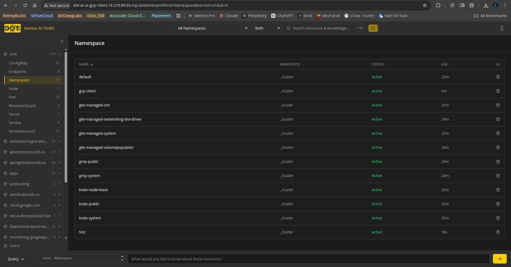
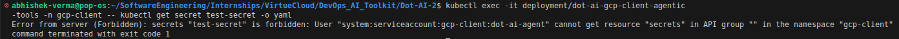

# DOT-AI GKE Client

Created by: Abhishek Verma
Created time: April 1, 2026 1:41 PM
Category: Mayank Sir, VirtueCloud
Last edited by: Abhishek Verma
Last updated time: April 1, 2026 2:11 PM

This document outlines the end-to-end workflow for onboarding a new client using Google Kubernetes Engine (GKE) to the Hub. The process uses a temporary GCP Service Account to bootstrap permanent, native Kubernetes RBAC tokens.

---

## Phase 1: Client Responsibilities (Granting Access)

The client must perform these steps in their Google Cloud environment to grant initial bootstrapping access.

### 1. Create a Service Account

Create a dedicated service account in the GCP project where the GKE cluster resides.

- **Naming Convention:** `dot-ai-onboarding@<client-project-id>.iam.gserviceaccount.com`  (this is used for demo)

### 2. Grant IAM Roles

Grant the service account the **Kubernetes Engine Cluster Admin** role (`roles/container.admin`) on the specific cluster (or at the project level).

> **Why this is required:** The `container.admin` role allows the gcloud CLI to fetch cluster endpoints and certificates. GCP's native IAM integration automatically maps this to the `cluster-admin` (system:masters) ClusterRole inside GKE, which is necessary to create the required Kubernetes ServiceAccounts and bindings.
> 

### 3. Generate and Share Credentials

Generate a JSON Service Account Key for the newly created account. Securely share the following details with the integration operator:

- The JSON Key File
- GCP Project ID
- GKE Cluster Name
- GKE Zone or Region

---

## Phase 2: Operator Responsibilities (Bootstrapping)

These steps are performed internally by the operator to establish the connection from the Hub.

### 1. Authenticate Locally

Authenticate your local terminal session using the client-provided JSON key via the gcloud CLI.

```bash
gcloud auth activate-service-account --key-file=client-onboarding-key.json
```

### 2. Configure the Client Variables

Update the specific `client.vars` file with the client's GKE details. (Assuming the BASE_DOMAIN is correctly set in the `client.vars` file)

```bash
# client.vars
CLOUD_PROVIDER="gke"
GKE_PROJECT="<client-project-id>"
GKE_CLUSTER_NAME="<client-cluster-name>"
GKE_ZONE="<cluster-zone-or-region>" # e.g., us-central1-c
```

### 3. Execute the Onboarding Script

Run the onboarding script using the configured variables file.

```bash
./onboard-client.sh client.vars
```

**What this script does:**

1. Leverages the active gcloud session to pull the `kubeconfig` into a temporary file (`gcloud container clusters get-credentials`).
2. Uses the native `cluster-admin` rights to create the `dot-ai-agent` and `dot-ai-controller-admin` K8s ServiceAccounts on the client cluster.
3. Generates long-lived Kubernetes tokens for those ServiceAccounts.
4. Passes the tokens back to the Hub via standard Helm/Kubernetes secrets and outputs the UI URL and Auth Token.



---

## Phase 3: Cleanup & Security Hand-off

Once the onboarding script successfully outputs the connection details, the bootstrapping phase is complete.

- **Action Required:** Notify the client that they can safely **delete or disable** the GCP Service Account and JSON key.
- **Reasoning:** The permanent connection is now established securely via native Kubernetes tokens, enforcing least privilege and removing reliance on cloud-provider IAM keys.

### Testing secret access in client from hub

- Result - Successful - we are denied access

